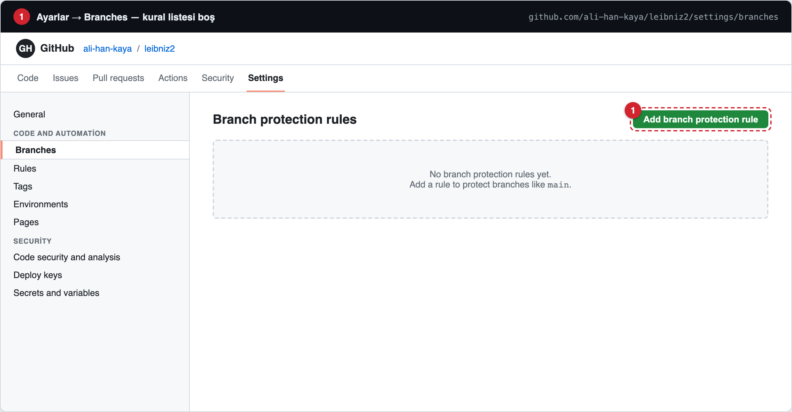
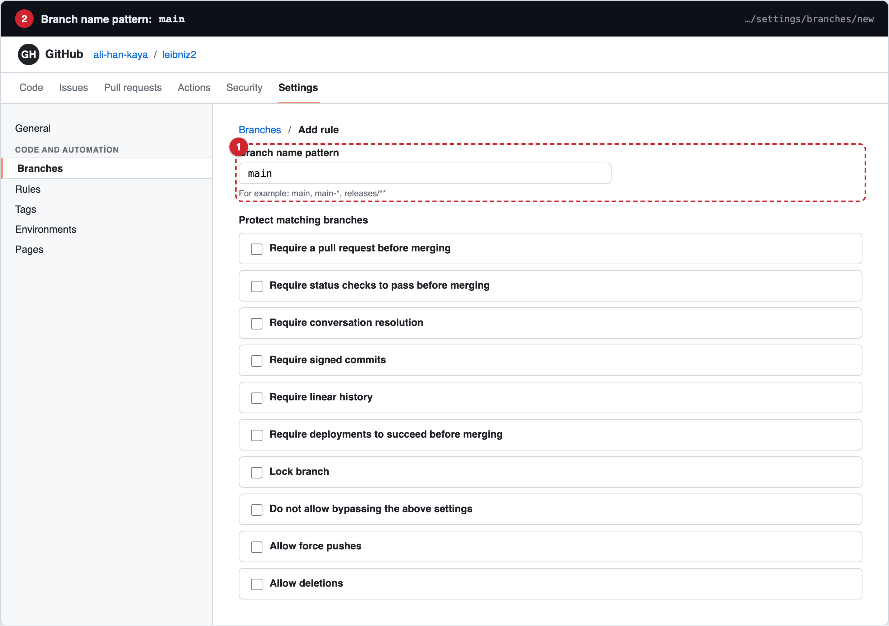
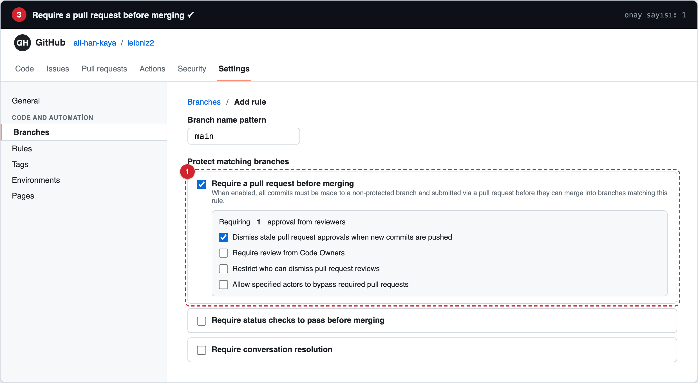
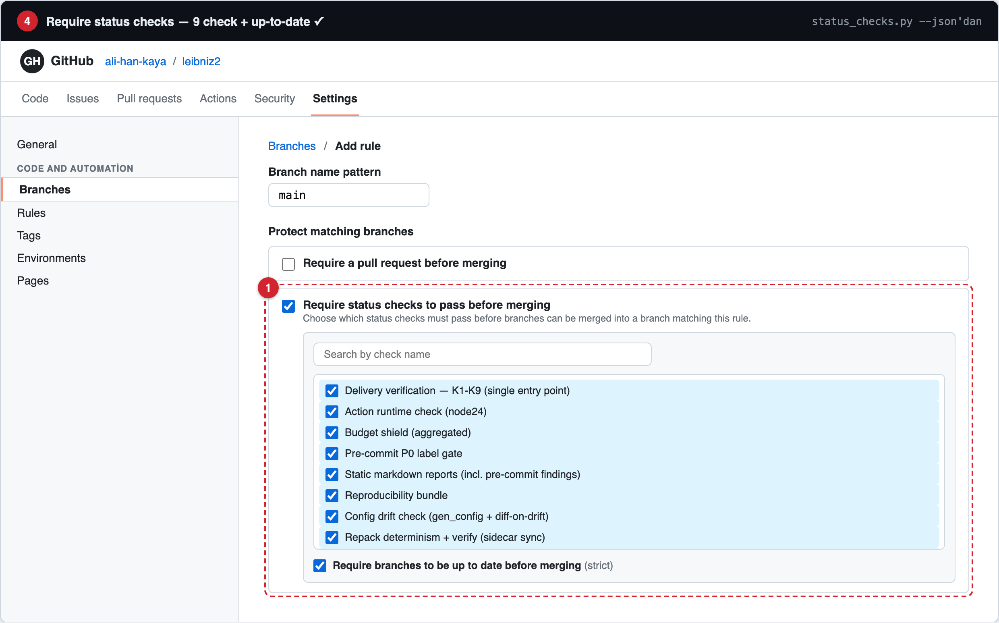
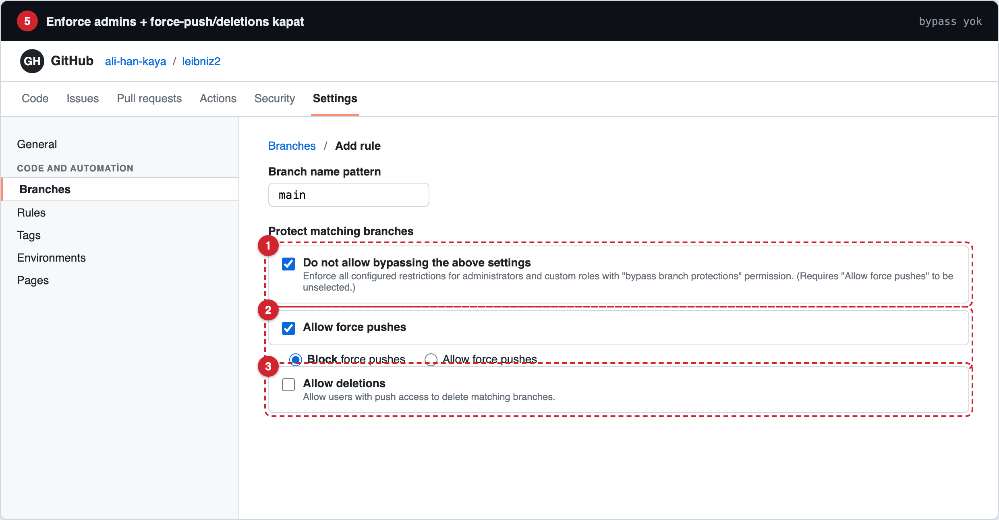
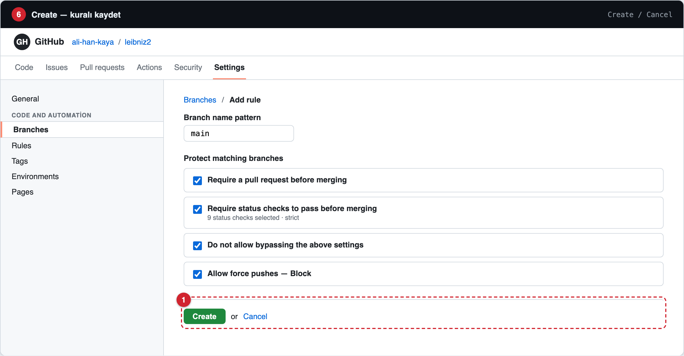
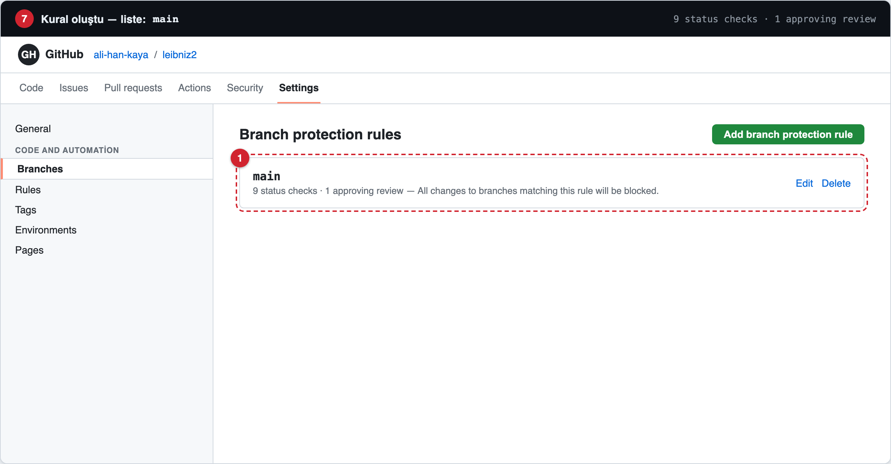
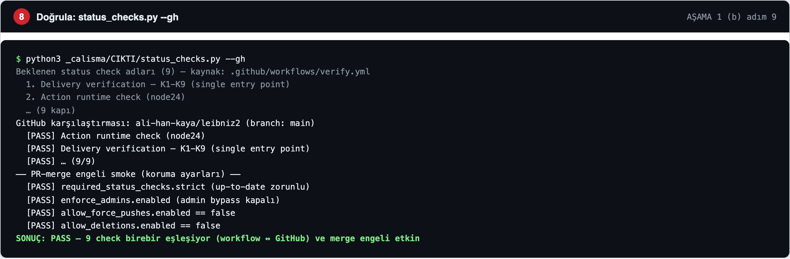

# Branch Protection — Görsel Kılavuz

[`docs/PUBLISH_SCENARIO.md`](../PUBLISH_SCENARIO.md) AŞAMA 1 (b) "Branch
protection — web UI adım adım" bölümünün görsel karşılığı. GitHub'ın
`Settings → Branches → Add branch protection rule` akışının her adımını
sırayla gösterir (9 required check için).

> **Önemli şeffaflık notu:** Bu görseller GitHub arayüzünün **birebir
> reprodüksiyonudur** — canlı ekran görüntüsü DEĞİL. Ayarlar sayfaları
> oturumlu tarayıcı gerektirdiğinden canlı yakalama otomatik üretilemez;
> kılavuz, `guide.html` kaynağından Playwright (headless Chromium) ile
> **deterministik** üretilir. Kaynak commit'li olduğu için yeniden üretilebilir
> ve denetlenebilir (`render_screens.py`). Tıklanacak öğeler kırmızı numaralı
> rozetlerle işaretlidir.

## Adımlar

### 1 — Ayarlar → Branches
Kural listesi boş; sağ üstte **"Add branch protection rule"** butonu.



### 2 — Branch name pattern: `main`
Kural yalnızca `main` için; "All branches" seçeneğini kullanma.



### 3 — Require a pull request before merging ✓
"Require approvals" için **1** bırak (tek kişilik repoda 0 da olur).



### 4 — Require status checks to pass before merging ✓
Arama kutusuna 9 check adını tek tek yazıp seç (`status_checks.py --json`
çıktısı — tek kaynak) ve **"Require branches to be up to date before
merging" (strict)** ✓ işaretle.



### 5 — Enforce admins + güvenlik
**"Do not allow bypassing the above settings"** ✓; **"Block force pushes"**
seçili; **"Allow deletions"** ✓ (Allow seçenekleri kapalı kalmalı).



### 6 — Create
Tüm ayarlar tamam; **Create** ile kaydet.



### 7 — Kural oluştu
Listede `main` kuralı: "9 status checks · 1 approving review".



### 8 — Doğrula
```bash
python3 _calisma/CIKTI/status_checks.py --gh
```
9 check + merge engeli smoke → `SONUÇ: PASS` (workflow ↔ GitHub birebir).



## Yeniden üret

```bash
_calisma/.venv_z3/bin/pip install playwright Pillow
_calisma/.venv_z3/bin/playwright install chromium   # bir kez (indirir ~92 MiB)
_calisma/.venv_z3/bin/python docs/branch-protection-guide/render_screens.py
```

`guide.html` değişince scripti tekrar koş — PNG'ler aynı boyutlarda yeniden
yazılır. Playwright yalnızca bu görsel kılavuzu üretmek içindir; CI zincirinde
**kullanılmaz** (birim testler + verify_delivery stdlib-only kalır).
